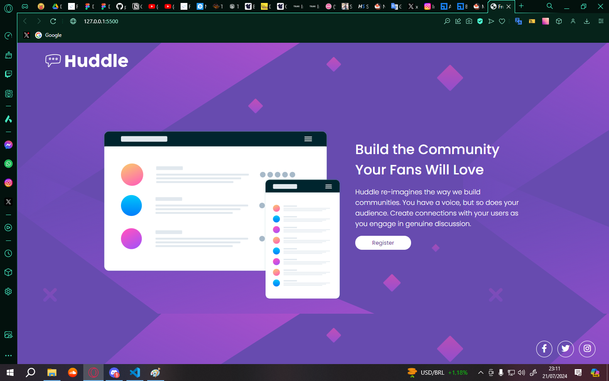

# Projeto Huddle Base

### Projeto do site FrontEnd Mentor.

Exercício no frontend mentor: https://www.frontendmentor.io/challenges/huddle-landing-page-with-a-single-introductory-section-B_2Wvxgi0

Estrutura do site:

1. Header onde se localiza a logo.

2. Main onde se localiza o conteúdo principal do site.

3. Footer onde se encontram as mídias sociais.

## Página em Desktop

## Página em Tablet

## Página em Mobile

## Tecnologias Utilizadas

 - HTML
 - CSS